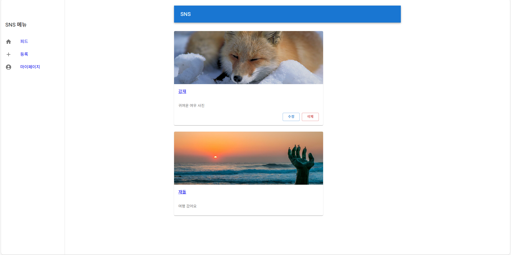
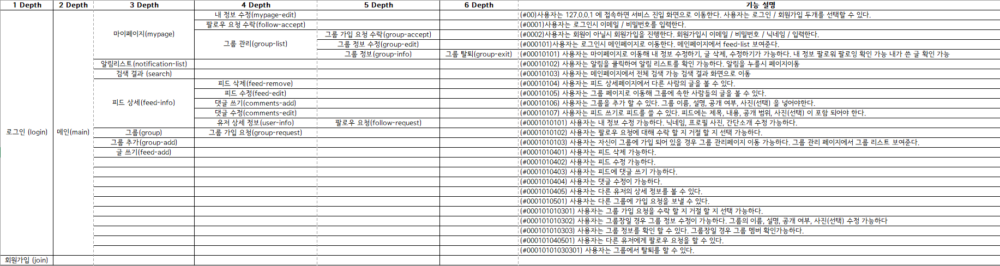
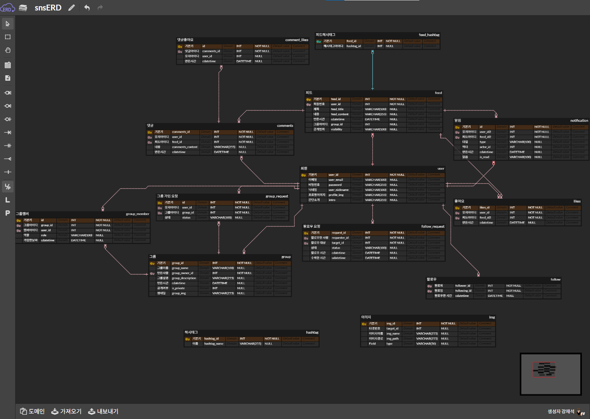
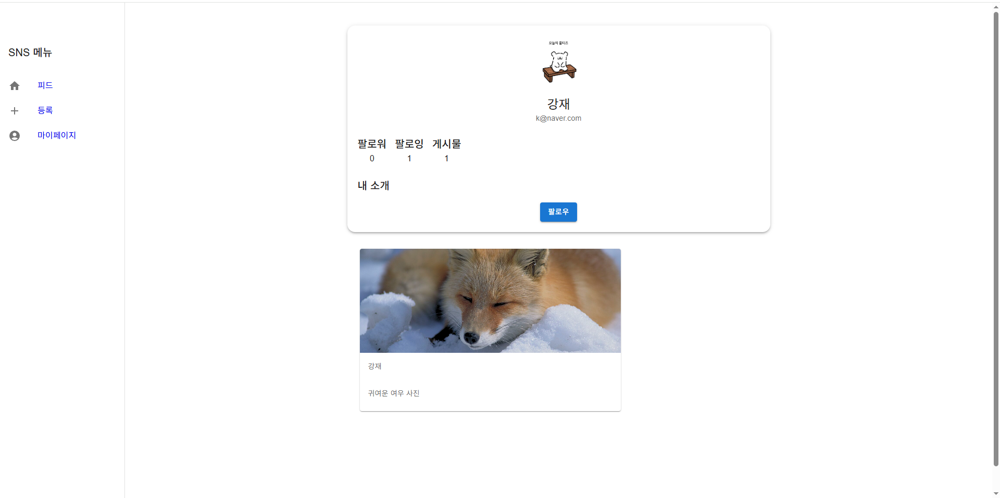
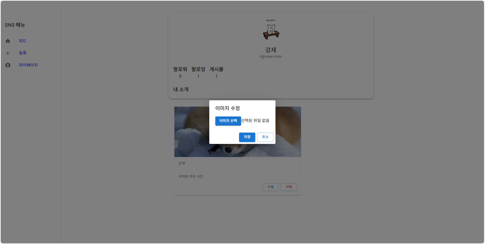
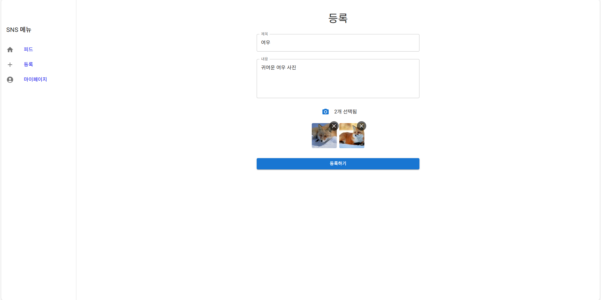

    

    

 
    <h2 style="border-bottom: 1px solid #d8dee4; color: #282d33;"> 🖥 프로젝트 소개 </h2>  
    
 
        <li> 소셜 네트워크 서비스를 만드는 개인 프로젝트를 진행했습니다.</li>
        <li> React를 활용하여 로그인과 회원가입 기능, 일상을 다른 사람과 공유할 수 있는 웹 사이트를 만들었습니다. </li>
    

    <h2 style="border-bottom: 1px solid #d8dee4; color: #282d33;"> ✔ 개발 기간 </h2> 
    <li>2025.05.07 ~ 2025.05.15</li>
    <h2 style="border-bottom: 1px solid #d8dee4; color: #282d33;"> ⭐ 사용 언어 </h2> 
    <ul> ✏사용 툴
        <li>Visual Studio Code</li>
        <li>ERDCloud</li>
    </ul>
     
    <ul> ✏기술 스택
        

        
        
        
        
        
        
    </ul>
    <h2 style="border-bottom: 1px solid #d8dee4; color: #282d33;">📝설계</h2>
    <h3>1. 화면 정의서</h3>
    
    <h3><a href="https://www.erdcloud.com/d/vixTqF4TMZMt9r46L">2. ERD 다이어그램</a></h3>
    
    <h2 style="border-bottom: 1px solid #d8dee4; color: #282d33;"> ⭐ 화면 및 기능 설명 </h2>
    <h3>1. 로그인</h3>
    
- 로그인 성공 시 세션 부여

    <h3>2. 회원가입</h3>
    
- 전체 내용 입력 후 회원가입 가능 

    <h3>3. Home </h3>
    
     
    
- 가입한 회원들이 작성하여 DB에 저장된 전체 게시글, 사진 표시 및 댓글 작성 기능 구현

    <h3>4. 내 프로필</h3>
    
     
    
- 작성한 글 목록 확인 가능

    <h3>5. 프로필 수정</h3>
    
     
    
- 프로필 사진 수정 가능(사진 첨부 기능 구현)

    
- 프로필 내용 수정 기능 구현

    <h3>6. 글 작성 </h3>
    
    
- 게시글 작성 기능 (사진 첨부 포함)

    <h3>7. DB 연결</h3>
    
- Node.js express 서버 -> DB 연결

    <h2 style="border-bottom: 1px solid #d8dee4; color: #282d33;"> 🚩 프로젝트 후기 </h2> 
    

        설계에 중점을 두어 개발을 진행하였으며, 기능 구현에 앞서 전체적인 서비스 흐름을 체계적으로 구성하기 위해 노력했습니다. 
        React의 Hooks 를 사용하면서 리액트의 특징에 대해 깊게 이해하는 계기가 되었습니다. 
        제한된 개발 기간 동안 핵심 기능에 집중하였고, 데드라인의 중요성에 대해 배웠습니다.
    

   

